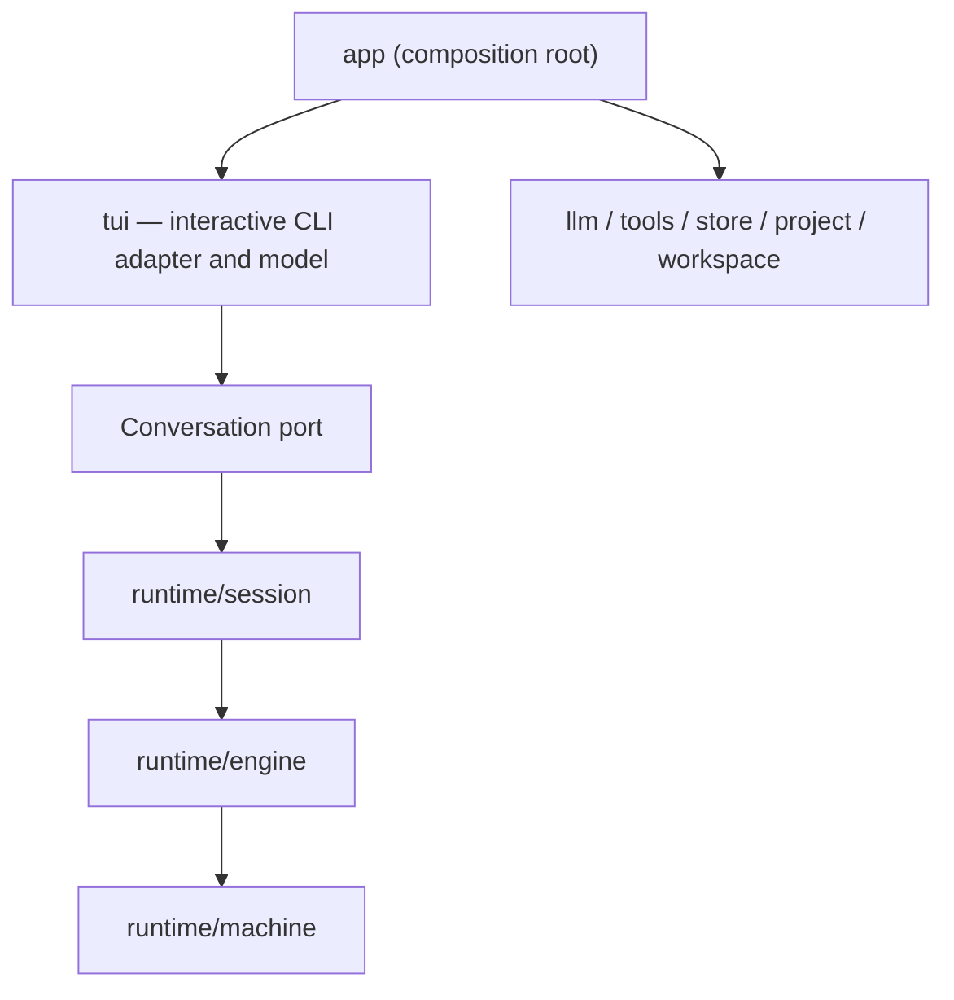

# Architecture

Super Agent follows a hexagonal architecture with a state-machine domain core.

## Dependency Rule

Dependencies point inward, toward `runtime/machine`. The rule is enforced, not merely
documented: `tests/architecture/test_dependencies.py` parses the imports of every package and fails
the build on a violation.

- `runtime/machine` is the domain core. It owns states, events, runtime-data changes, action plans,
  scheduled actions, and transitions. See `machine.md`.
- `runtime/protocol` owns model and tool adapter contracts (`Message`, `ToolCall`, `Model`,
  `ToolRunner`) without state-machine policy.
- `runtime/permission` owns permission request and command classification value types.
- `runtime/engine` drives the machine. It owns the single agent loop, synchronization,
  scheduled-action draining, and run identity. See `runtime.md`.
- `runtime/execution` implements outbound model, tool, and permission ports.
- `runtime/session` exposes application use cases. It must not contain terminal behaviour, and it must
  not import `os` or `pathlib` — filesystem access goes through ports.
- `tui` owns `TerminalApplication` and its framework-neutral interaction model. Rich is confined to
  this adapter; it depends on the application only through `Conversation` ports and display DTOs.
- `app` is the composition root. It creates dependencies and converts runtime values to interactive
  CLI values.
- `llm`, `tools`, `store`, `project`, and `workspace` are top-level adapters. `llm` and `tools` may
  import `runtime/protocol` but not the root `runtime` facade; `store` and `workspace` may also import
  `runtime/session`, which is where their ports are declared.

Importing `llm` or constructing a built-in model must not import a provider SDK. The selected
provider adapter and its SDK are loaded on the first model request, so unrelated providers do not
delay terminal startup.

`tui` must never import `runtime`, and the runtime must never import `tui`. Runtime states become
presentation-only `tui.AgentStatus` values at the app boundary, in `app/tui_adapter.py`; the
interactive CLI owns no runtime state enum.

The root `runtime` package is a compatibility facade organized by `api_model.py`, `api_machine.py`,
`api_execution.py`, `api_engine.py`, and `api_session.py`. It exposes session persistence ports and
metadata without importing concrete adapters. Internal packages must depend on the narrow package
that owns a type, not on this facade.

`ToolBatchReceived`, `ToolCallNeedsApproval`, and `ActionResultResolver` are the canonical names for
tool-batch intake, approval requests, and result mapping; the runtime re-exports no second name for any
of them.

`TerminalApplication` is the only interaction surface. Headless execution, HTTP, WebSocket,
full-screen TUI, and alternate UI adapters are out of scope.

## Package Boundaries

`runtime/machine` is the pure domain core. It performs no I/O, takes no locks, and calls no model or
tool. Its file layout:

- `state.py`: the runtime state type and its constants.
- `event.py`: the event interface, event kinds, and `ALL_EVENTS`.
- `runtime_data.py`: the complete mutable machine data.
- `runtime_data_change.py`: the runtime-data change vocabulary and `ALL_RUNTIME_DATA_CHANGES`.
- `runtime_data_change_applier.py`: transactional clone, apply, and validate.
- `action_plan.py`: the post-transition action-queue plan.
- `scheduled_action.py`: the post-commit scheduled-action vocabulary and `ALL_SCHEDULED_ACTIONS`.
- `tool_batch.py`: queued tool-batch state.
- `snapshot.py`: snapshot construction and state invariants.
- `transition.py`: the static transition registry and its handlers.

`runtime/engine` is split by responsibility:

- `engine.py`: dependencies and construction.
- `commands.py`: lifecycle, approval, policy, and context commands.
- `action_loop.py`: transition dispatch and scheduled-action draining.
- `query.py`: state queries and immutable snapshots.

Engine files name `machine`, `execution`, and `protocol` types explicitly; the package has no internal
alias facade.

`runtime/execution` implements the ports:

- `scheduled_action_runner.py`: executes scheduled actions, returns `ActionCompletion` values.
- `scheduled_action_executor.py`: calls the model or the tool runner.
- `scheduled_action_result.py`: the result vocabulary.
- `action_queue.py`: the post-commit scheduled-action queue.
- `action_result_resolver.py`: maps results to transition-ready events and classifies tool calls.
- `policy.py`: permission decisions. `command_analyzer.py`: shell inspection and classification.
- `approval_store.py`: always-allow and auto-approve state. `run_controller.py`: run id, cancel
  function, and stale-result checks.

`runtime/session` separates use cases by intent:

- `session.py`: construction, configuration, reset, and snapshots.
- `turn.py`: one conversational turn and the approval flow.
- `history.py`: saved sessions, compaction, and undo.
- `persistence.py`: persistence notifications.
- `notifications.py`: the session-to-UI notification protocol.
- `repository.py`: the persistence and workspace ports, including checkpoint creation,
  `load_undo_point`, `truncate_after`, and the one-time `save_workspace_description` upgrade.

Interactive CLI behaviour is specified in [`terminal.md`](terminal.md).

`project` resolves the selected project independently from filesystem access policy. `workspace.Context`
is the process-independent source of truth for workspace roots and cwd, while `workspace.Workspace`
adapts it to the session checkpoint, attachment, export, and workspace-restore ports (including the
one-time canonical upgrade of legacy saved paths). `store/store.py` writes and replays
durable session records — see `session.md` for the durability ordering it maintains. `app/mcp.py`
coordinates MCP lifecycle, dynamic tool registration, rollback, and atomic settings persistence.

## Refactoring Rules

- Prefer concrete domain names over generic plumbing names.
- Keep interfaces at adapter boundaries, not between every internal function.
- Keep files focused on one responsibility.
- Convert transport and display DTOs only at the composition boundary.
- Preserve behaviour with transition and application-use-case tests.
- Do not scatter transition rules into `tui/`, `llm/`, or `tools/`.
- Keep `RunID` stale filtering in the engine. Keep state, call-id, queue guards, and invariants in
  `runtime/machine`.

Use the existing vocabulary: `State`, `RuntimeData`, `Event`, `RuntimeDataChange`, `ActionPlan`,
`ScheduledAction`, `transition`.
